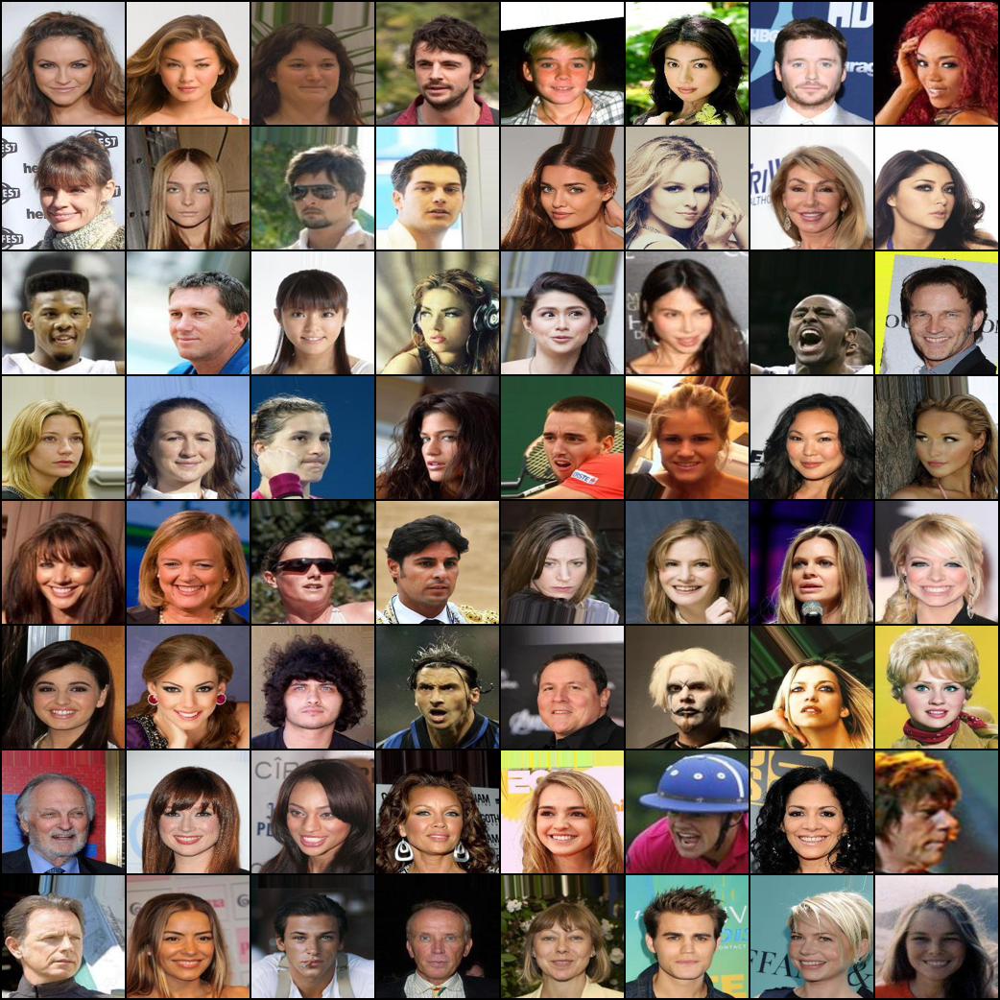
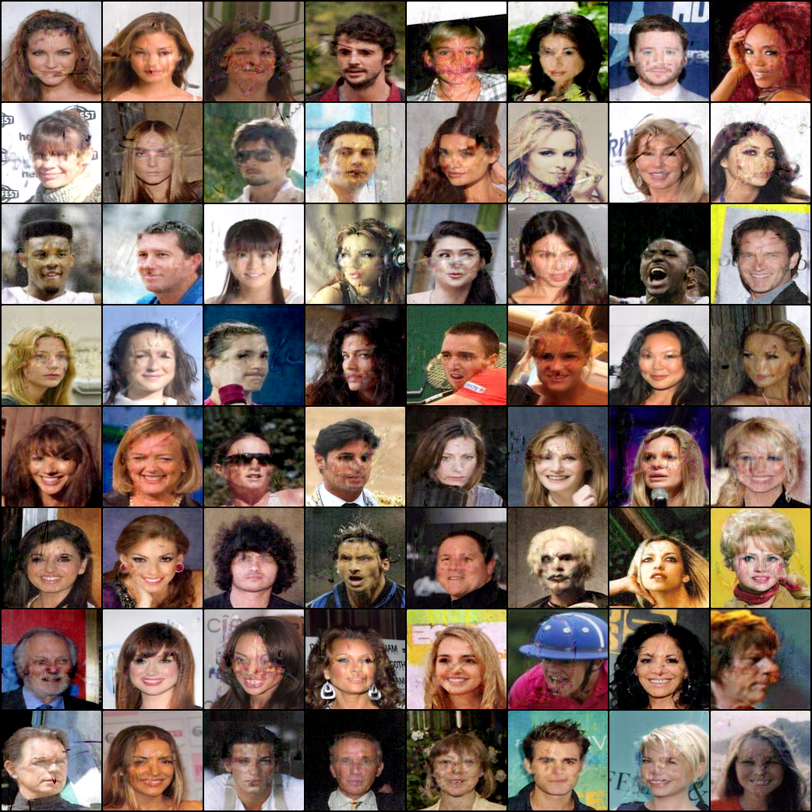

## Computer Security Project

> Jisu Kang, Sohee Kim
> KENTECH Energy AI track

Adding signature into human image to prevent modifying human image in bad way.

For this, we use AutoEncoder.  The input is human face image and signature.

Then the first AutoEncoder hides the signature images into human face images.  

After that, an identifier who want to know this image's integrity uses second AutoEncoder.

Second AutoEncoder takes **signature-hidden-images** as input and outputs the hidden signature. 

Then the identifier may know whether the image is modified or not.

  

 

