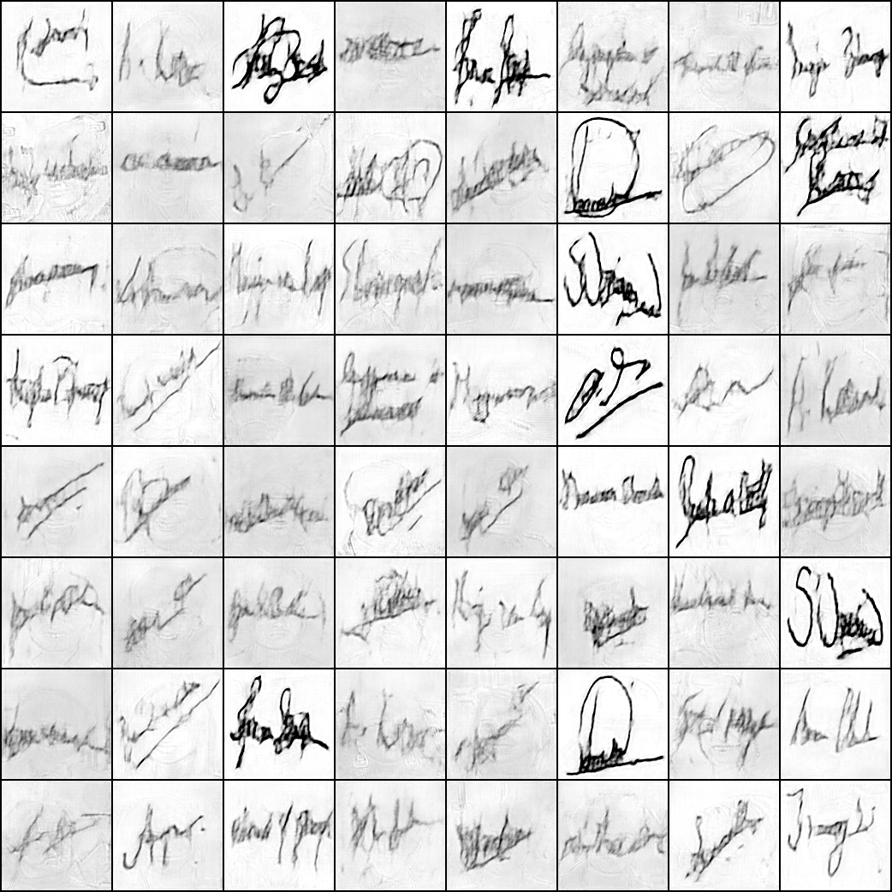
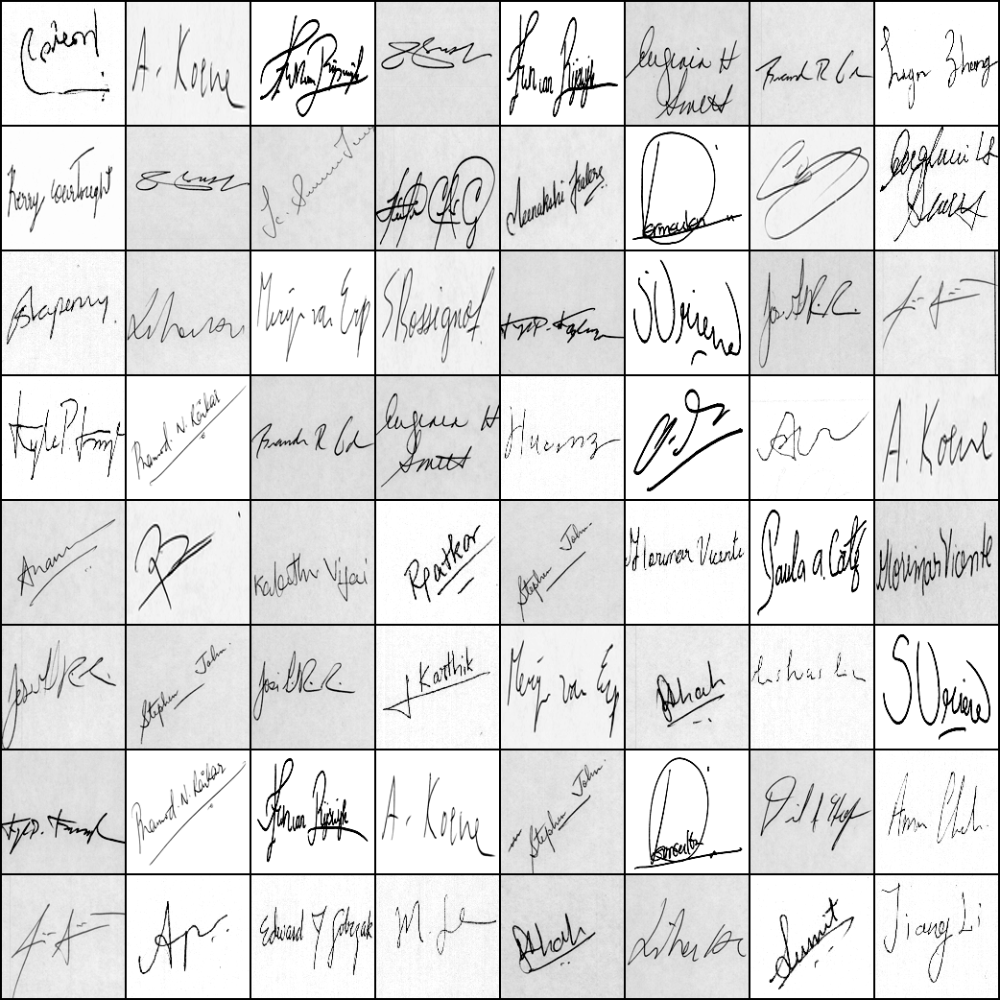

## Computer Security

Adding signature into human image to prevent modify human image in bad way.  
For this, we use AutoEncoder.  
The input is human images and signature.

Then the first AutoEncoder hides the signature images into human face images.  
After that, An identifier who want to know this image's integrity uses second AutoEncoder.

This AutoEndoer takes signature-hided-images as input and ouputs the hiden signature.  
Then the identifier may know whether it is modified or not.

<left>  </left>
   

 

<!-- 
> 화,목 9:00~10:30

- #### work

  | Week    | Date            | Detail                    |
  | ------- | --------------- | ------------------------- |
  | Week 7  | 23.04.13 (Thur) | Mid-term exam             |
  | Week 11 | 23.05.11 (Thur) | Term project presentation |
  | Week 14 | 23.05.30 (Tue)  | Final report              |
  | Week 16 | 23.06.15 (Thur) | Final exam                |

- Project
  - Introduction
    - 실제로 프로토콜 디자인
    - 간단한 implement
    - 어떻게 evalutation 하는가 (보안성에 대한 analysis, )
    - 기본적은 goals 외의 하나를 더 추가해서 거기에 맞게 디자인
      - goal 두가지, engineering goal 하나 (privacy, 데이터 양 등등)
      - evaluation 
  - 시나리오
    - IOT 카메라가 사진 찍어서 서버에 보내는 것 (주기적으로) - 이 때 통신 (이미지 보냄)
    - 스마트폰의 2개 센서 데이터를 클라우드에 보내는 것 (작은 데이터 보냄)
    - 원격시스템에 대한 controller가 control message를 보내는 것
  - TODO
    - 2인 1조
    - 최종 작업물 : code, final report(overleaf) (한 페이지에 그림 넣어서)
  - 평가 기준
    - 디자인 goal 3개, 골에 맞게 디자인했고 잘 argue 하는가
    - writing quality (grammar)
  - 4월 18일까지 팀 구성
  - 5월 11일 발표 - 기본적인 디자인, 전제로 하는 공격자, 3개의 골 세우기
    - 시나리오에 specific 한 골 1개 (security 아니더라도) performance 관련 부분
    - 심플해도 괜찮음.
    - 어떻게 구현할 것이고, 어떻게 평가할 것인지 평가 기준 (골 달성 기준)
    - 피피티 형식. 영어로 발표
  - Final report (5월 30일)
    - Introduction : 내가 선택한 시나리오. 왜 중요한지는 X, 어떠한 암호화 프로토콜을 개발하려고 하고, 대략 어떤 골을 달성하는 것을 제시한다. summary 형식
    - Overview : 시나리오 디테일 - 주고받을 메세지가 무엇인지. 
    - Evaluation  -->
